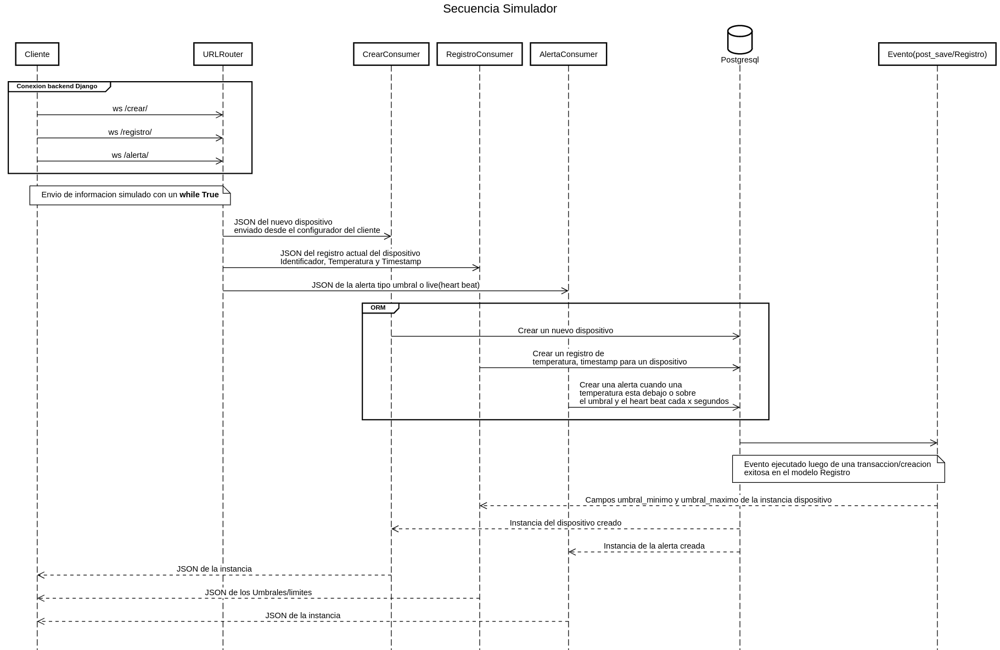

# Backend Django Channels

## Diagrama de secuencia



## Docker usando Makefile

```console
$ sudo make build
$ sudo make manage CMD="migrate"
$ sudo make pytest
$ sudo make up
```

## Simulador

[Enlace](https://github.com/luishiguera/simulador/tree/main/script)