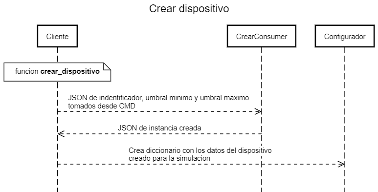

# Simulador dispositivo
Simulador de dispositivo IoT en python con el cliente websocket

## Funcionamiento
Funcion para crera un dispositivo por medio de la terminal, tomando valor de identificador, umbrales que seran registrados en la base de datos.



```python
def crear_dispositivo():
    identificador = input("Ingrese identificador (4 digitos): ")
    umbral_minimo = int(input("Ingrese umbral minimo: "))
    umbral_maximo = int(input("Ingrese umbral maximo: "))

    datos = {
        'identificador': identificador[:4],
        'umbral_minimo': umbral_minimo,
        'umbral_maximo': umbral_maximo
    }

	# Se envia en JSON al CrearConsumer del backend
    WS_CREAR.send(json.dumps(datos))
    
    # Respuesta del backend y se transforma en dict
    # misma instancia pero ya guardada en la base de datos
    resultado = json.loads(WS_CREAR.recv())['creado']

	# Configuracion para el simulador
    configurador = {
        'identificador': resultado['identificador'],
         # Aseguramos que pueda salir del umbral registrado en la base de datos
         # Restandole y sumandole a los umbrales
        'umbral_minimo': resultado['umbral_minimo'] - randrange(1, 5),
        'umbral_maximo': resultado['umbral_maximo'] + randrange(1, 5)
    }

    return configurador
```

```python
# Se llama la funcion que devolvera la configuracion
conf = crear_dispositivo()

# "constantes" para el simulador
ID_DISPOSITIVO          = conf['identificador']
SEGUNDOS_HEART_BEAT     = 10
SEGUNDOS_TEMPERATURA    = 2.0
RANGO_MENOR_TEMP        = conf['umbral_minimo']
RANGO_MAYOR_TEMP        = conf['umbral_maximo']
```

Funciones heart_beat para enviar el keep a live y temperatura que generan la informacion que sera enviado a los consumers. 

```python
def heart_beat():
    timestamp = int(time.time())

    datos = {
        'id_dispositivo': ID_DISPOSITIVO,
        'timestamp': timestamp,
        'opcion': 'live',
    }
    yield datos

def temperatura():
    timestamp = int(time.time())

    time.sleep(SEGUNDOS_TEMPERATURA)
    datos = {
        'id_dispositivo': ID_DISPOSITIVO,
        'temperatura': randrange(RANGO_MENOR_TEMP, RANGO_MAYOR_TEMP), # Rangos del configurador modificados en -/+
        'timestamp': timestamp,
    }
    yield datos
```

```python
# Obtenes el timestamp actual en el momento de ejecucion que se volvera pasado una vez
# Ha entrado al while
pasado = time.time()

while True:
	# Se obtiene los datos generados de la funcion temperatura
    datos = next(temperatura())
    
    # Se envian en JSON al RegistroConsumer
    WS_REGISTRO.send(json.dumps(datos))
    # Respuesta del consumer
    respuesta = json.loads(WS_REGISTRO.recv())
    print(VERDE + f"Resultado de registro (Umbrales del dispositivo): {respuesta}")
    print(AZUL + f"Temperatura enviada {str(datos['temperatura']) + chr(176) + 'C'}")
	
    # Validacion de los umbrales del configurador/funcion temperatura
    # con respecto a los devuelto por el consumer
    if datos['temperatura'] <= respuesta['umbral_minimo'] or datos['temperatura'] >= respuesta['umbral_maximo']:
   
   		# Si pasa los limites se envia un JSON a AlertaConsumer
        # de tipo umbral
        datos['opcion'] = 'umbral'
        WS_ALERTA.send(json.dumps(datos))
        print(ROJO + f"Alerta registrada Umbral: {WS_ALERTA.recv()}")

	# Validacion del tiempo pasado en la variable creada fuera con respecto al actual de ejecucion del while
    # se obtiene la diferencia y se compara con la constante SEGUNDOS_HEART_BEAT declarada anteriormente
    if (time.time() - pasado) > SEGUNDOS_HEART_BEAT:
    	# Se obtiene los valores de la funcion heart
        beat = next(heart_beat())
        beat['temperatura'] = datos['temperatura']
        
        # Se envia el JSON a AlertaConsumer
        WS_ALERTA.send(json.dumps(beat))
        
        # Se reasigna la variable pasado
        pasado = time.time()
        print(ROJO +f"Alerta registrada Beat: {WS_ALERTA.recv()}")
```

## Configuracion

Configurar la ip del websocket desplegado en Docker o en terminal
```python
WS_CREAR = create_connection("ws://172.18.0.1:8000/crear/")
WS_ALERTA = create_connection("ws://172.18.0.1:8000/alerta/")
WS_REGISTRO = create_connection("ws://172.18.0.1:8000/registro/")
```

## Ejecucion

### Sin Docker

```console
python simulador.py
python3 simulador.py (LINX)
```

### Docker
```console
$ sudo docker build -t python-simulador .
$ sudo docker run -i -t python-simulador
```
